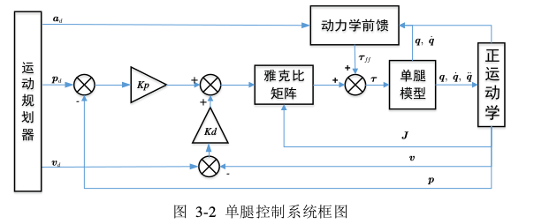
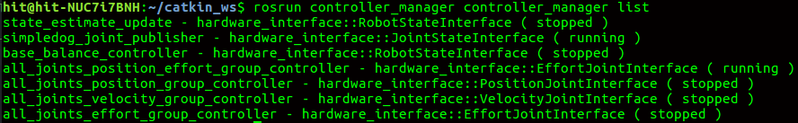
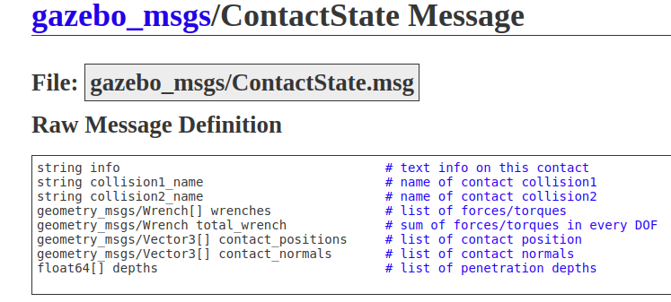

# Some notes about balance controller

## 1. Balance controller for support leg.

- **Desired robot state input**

从free_gait的StateRosPublisher.cpp发出，由ros_controller接收，消息类型为const free_gait_msgs::RobotState，储存在指针free_gait::state robot_state中。

**从action_server_test_node运行，就一直向话题/desired_robot_state发布数据。**

```
void RosBalanceController::baseCommandCallback(const free_gait_msgs::RobotStateConstPtr& robot_state_msg)
```


- **UPDATE()主函数：**

获取actual关节参数：位置、速度、力矩；
获取target关节位置，只用于摇摆腿的关节控制模式；
设置target足端位置、速度,用于单腿动力学控制；
获取actual关节位置、角速度,用于单腿动力学控制；
接触状态机，进行一些参数改动；
获取target身体姿态、线速度、角速度，用于平衡控制；
获取actual身体姿态、线速度、角速度，用于平衡控制；
求身体虚拟力与虚拟力矩；
求足端分配力；
设置stance leg关节力矩；
设置swing leg关节力矩，或关节位置，根据不同的控制模式；

- **平衡控制器的输入:**
身体姿态、线速度、角速度；

- **平衡控制器的反馈量：**
身体实际姿态、线速度、角速度；

## 2. Single leg controller for swing leg.

使用单腿动力学控制，详细见文献，调用single_leg_solver，RDBL求出关节力矩。

- **单腿控制器的目的：**
在单腿操作空间中，跟踪足端的运动轨迹

- **控制器的控制输入：**
足端规划的加速度、速度、位置；

- **控制器的反馈量：**
关节的加速度、速度、位置；





## 3. Running process.

- **Controller Manager**

除了在终端启动控制器以外，还可创建launch文件加载启动控制器。


**Load and start:**
```
<launch>

<node pkg="controller_manager"

type="spawner"

args="controller_name1 controller_name2" />

</launch>
```

**Load and not start yet:**
```
<launch>

<node pkg="controller_manager"

type="spawner"

args="--stopped controller_name1 controller_name2" />

</launch>
```

在运行`roslaunch simpdog quadruped_simulation.launch`文件后，已经启动了控制器Controller。

可用命令`rosrun controller_manager controller_manager list`查看当前控制器的运动状态：


## 4. Foot Sensor Controller.
  在urdf中插入Contact Controller,从Gazebo中获取足端接触信息，话题名称也是在urdf中定义。

  **gazebo_msgs/ContactState.msg 消息格式**


