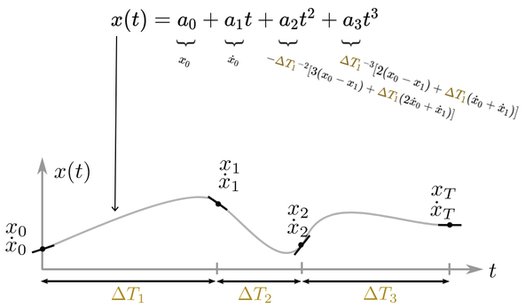

# Towr_ros_Note


## 1. Problem Formulation

**A. 问题定义**


**B. 优化变量的参数化:**

- 四次多项式表示身体运动，相位时间固定，并优化多项式参数；
- 三次多项式表示足端运动；
- 三次多项式表示足端力变化；
- 基于优化变量中的相位持续时间，决定足端相位时间和多项式相位时间；

**C. 足端运动与足端力参数化**


- 通过常值、多项式求导表示足端运动与足端力变化；
- 相位持续时间△T~i~~j~可以通过优化器来改变;

**TOWR Flow Chart Written By Eric Wang**


**在构造变量时，已经将变量设置于约束之下:**
```
    double x = final_ee_pos_W.x();
    double y = final_ee_pos_W.y();
    double z = terrain_->GetHeight(x,y);
```


## 2. Variable

- **根据初始状态和最终状态以及总的时间，确定中间状态：**
```
void SetByLinearInterpolation(const VectorXd& initial_val,
                              const VectorXd& final_val,
                              double t_total);
```

- **Observer作用：**
```
NodesObserver //Base class to receive up-to-date values of the NodeVariables.
```
This class registers with the node variables and everytime the positions or velocities of a node change, the subject updates this class by calling the `UpdatePolynomials()` method.
```
Phase_durations_observer //Base class to receive up-to-date values of the ContactSchedule.
```
This class registers with the contact schedule and everytime those durations change, the contact schedule updates this class by calling the `UpdatePhaseDurations()` method.

- **Spline 样条曲线**

将多个单独的多项式拼接成一条样条曲线.

- **SplineHolder**

样条曲线的组合
```
SplineHolder (NodesVariables::Ptr base_lin,
                NodesVariables::Ptr base_ang,
                const std::vector<double>& base_poly_durations,
                // Nodes that are associated to either swing or stance phases.
                std::vector<NodesVariablesPhaseBased::Ptr> ee_motion,
                std::vector<NodesVariablesPhaseBased::Ptr> ee_force,
                std::vector<PhaseDurations::Ptr> phase_durations,
                bool ee_durations_change);
```

- **三次多项式**




```
void CubicHermitePolynomial::UpdateCoeff() // 更新多项式系数
{ //the start and final node comprising the polynomial.
  coeff_[A] =  n0_.p(); // pos
  coeff_[B] =  n0_.v(); // vel
  coeff_[C] = -( 3*(n0_.p() - n1_.p()) +  T_*(2*n0_.v() + n1_.v()) ) / std::pow(T_,2);
  coeff_[D] =  ( 2*(n0_.p() - n1_.p()) +  T_*(  n0_.v() + n1_.v()) ) / std::pow(T_,3);
}
```

- **状态变量类Node**

`A node represents the state of a trajectory at a specific time.`
给定一系列节点，通过插值可以得到三次多项式。因此，优化的节点变量得到后，连续的轨迹样条曲线便可得到。

## 3. Constraint

```
ifopt::ConstraintSet::ConstraintSet (int n_constraints, const std::string &name )
```
TOWR中的各种约束均继承这个`ConstraintSet`这个类，对每个变量进行约束。

- **Terrain**
`formulation_.terrain_ = HeightMap::MakeTerrain(terrain_id);`
返回一种障碍物信息类的指针，每一种障碍物信息如Block，含有高度等信息，继承于`HeightMap`这个基类。

**中间节点约束方法,注意每个约束文件中的`GetValues()函数`：**
```
for (int id : node_ids_) {
  //! eric_wang: Position.
  Vector3d p = nodes.at(id).p();
  //! eric_wang: Set the endeffector height constraint.
  g(row++) = p.z() - terrain_->GetHeight(p.x(), p.y());
}
```

## 4. Cost

## 5. IPOPT

IPOPT使用**内点法**(Interior Point Method)，是一种求解线性规划或非线性凸优化问题的算法。

- **IPOPT Iteration Output**


- **IPOPT With Program Code**

在调用IFOPT算法时，需要向IFOPT提供以下信息:

目标函数梯度矩阵、 约束条件雅克比矩阵、二阶偏导数组成的hessian矩阵


- **IPOPT Programming Exercise**


## 5. Optimization Output

在`towr_interface_ros.cc`文件中，优化结束后，可以将规划轨迹发送给控制器:

```
// to publish entire trajectory (e.g. to send to controller)
   xpp_msgs::RobotStateCartesianTrajectory xpp_msg = xpp::Convert::ToRos(GetTrajectory());
```


这里的消息是xpp_msgs/RobotStateCartesian:
```
================================================================================\n\
MSG: xpp_msgs/RobotStateCartesian\n\
# The state of a robot expressed in the Cartesian frame\n\
\n\
duration                time_from_start   # global time along trajectory\n\
\n\
# Position, velocity and acceleration of the base expressed in world frame\n\
# The orientation quaternion maps base to world frame.\n\
State6d                 base              # base pos/vel/acc in world\n\
\n\
StateLin3d[]            ee_motion         # endeffector pos/vel/acc in world\n\
geometry_msgs/Vector3[] ee_forces         # endeffector forces expressed in world\n\
bool[]                  ee_contact        # True if the foot is touching the environment\n\
\n\
\n\
\n\
\n\
================================================================================\n\
```
## 6. XPP
XPP提供的RVIZ GUI插件**CartesianVisualization**，可以显示机器人状态，对应的消息类型为：
`<xpp_msgs::RobotStateCartesian>`


## 7. TODO LIST

- 规划结果中只有足端位置，需要另外规划摇摆腿的运动轨迹；
